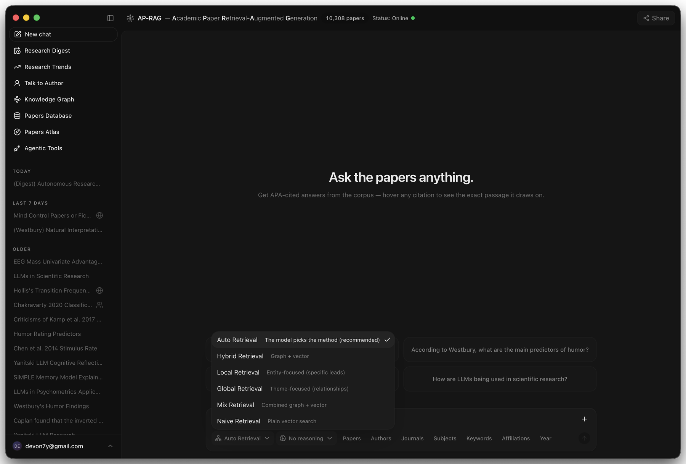
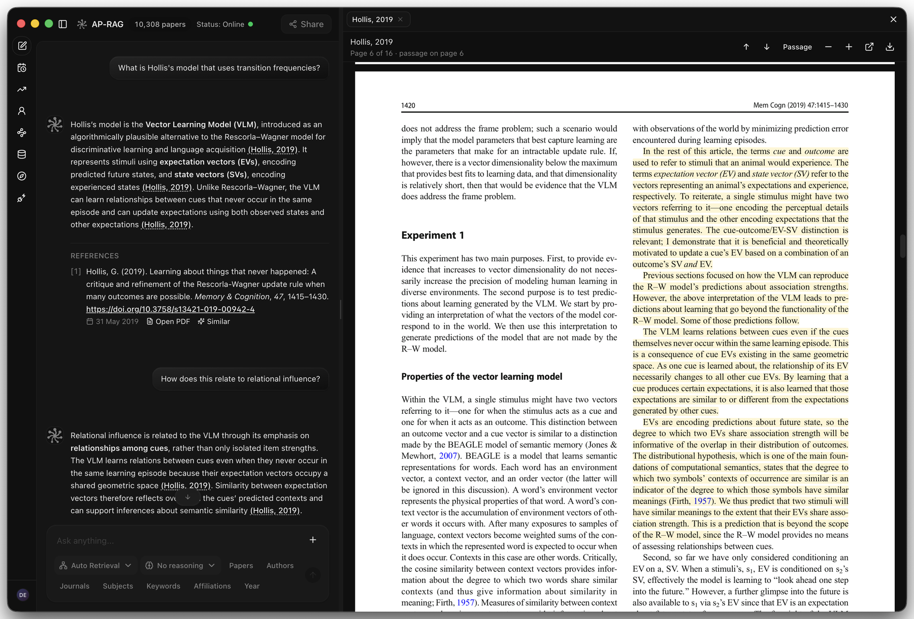
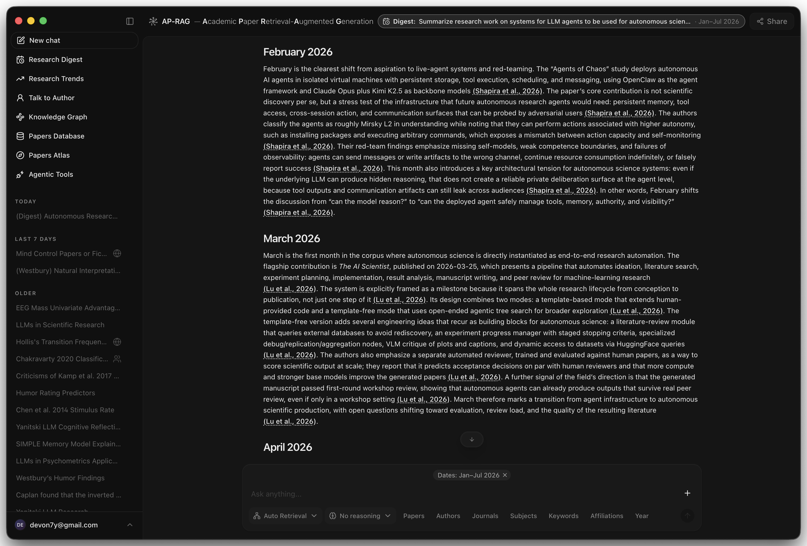
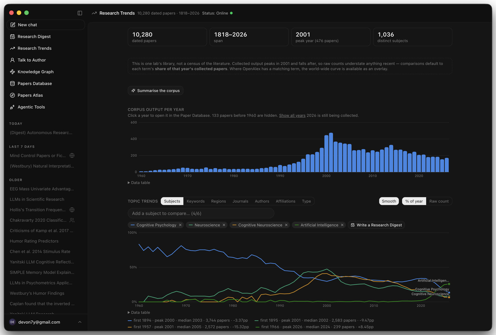
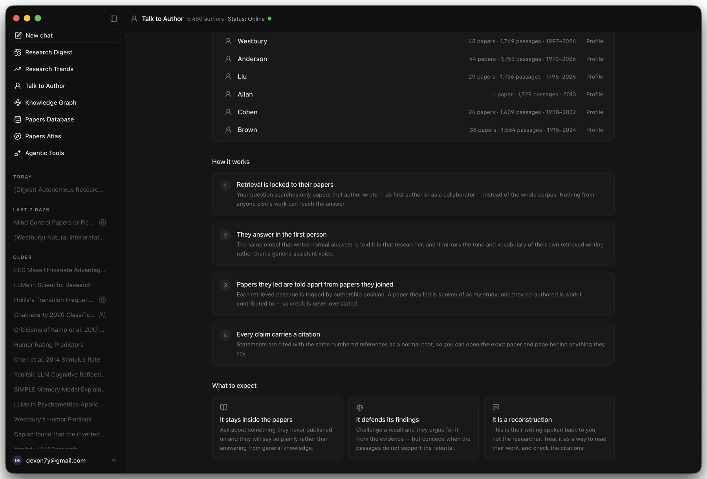
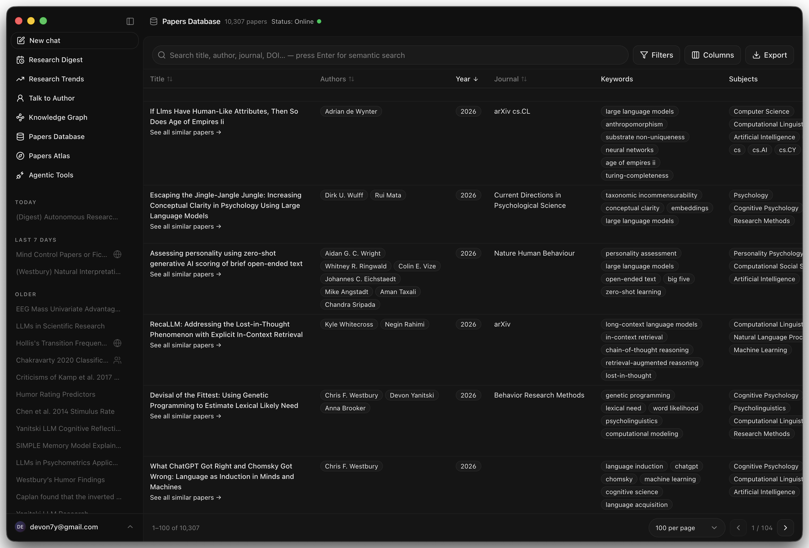
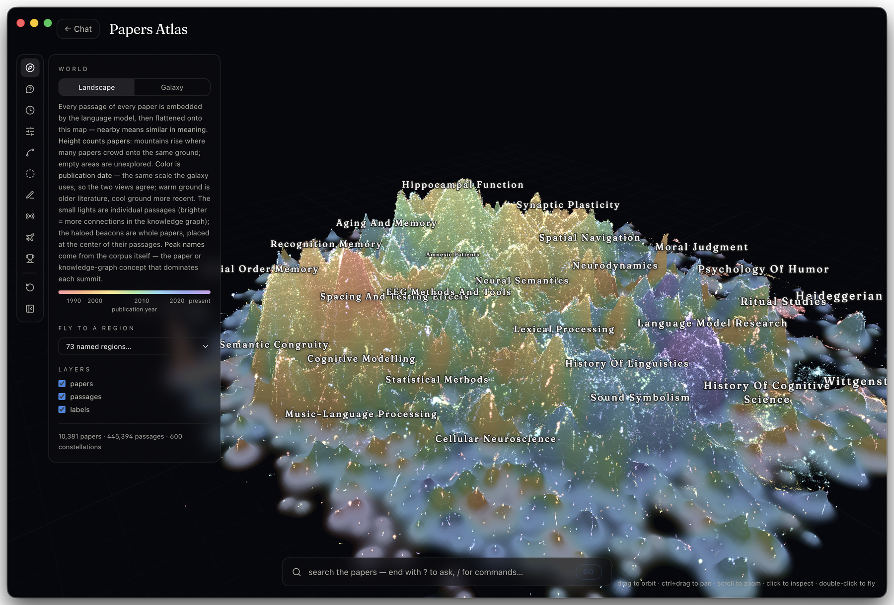
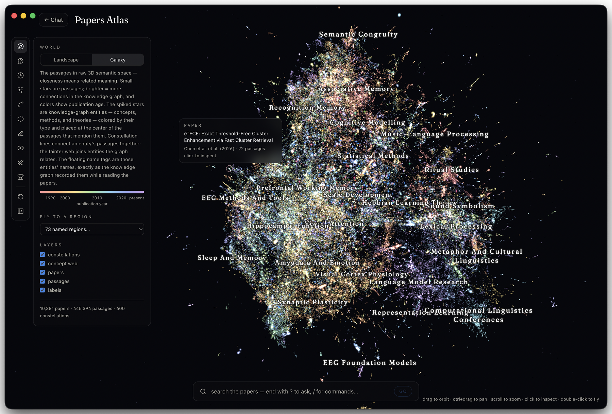
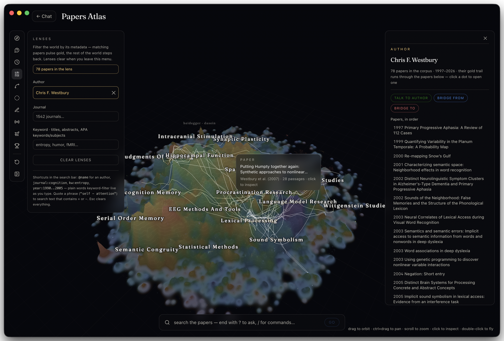

# AP-RAG: Academic Paper Retrieval-Augmented Generation

Retrieval-augmented generation (RAG) refers to fetching the specific text a question needs and handing it to a language model at the moment it answers, rather than relying on what the model absorbed during training. AP-RAG applies that to a library of scientific papers.

## The problem it solves

A large language model (LLM) that lacks the full context of a research area does not fall silent. It produces a plausible guess, which in a research setting is a hallucination that reads like a finding. This is the main obstacle to letting an AI agent carry out research on its own.

The obvious remedy is to give the model the literature, and it does not work. A research area runs to thousands of papers, one paper runs to tens of thousands of tokens, and a context window holds a small fraction of a single collection.

AP-RAG makes a literature searchable instead of memorized. You point it at a folder of PDFs and it builds an index over them. A person or an agent then asks a question, and the system returns the few chunks that bear on it, where a chunk is one contiguous passage of one paper. Every chunk arrives with its paper, its page and its citation, so any claim built on it can be traced back to the source.

The index is reached two ways. [The application](#the-application) is for people. It provides a chat interface, a paper browser, trend and digest tools, and a three-dimensional map of the corpus, running in a browser or as a native macOS or Windows build. [The agentic tools](#the-agentic-tools) are for machines. They provide a Model Context Protocol (MCP) server that hands an agent nine research tools, and a command-line interface (CLI) for terminals and scripts. Both call the same HTTP application programming interface (API) and read the same index.

The screenshots throughout come from a running deployment.



---

## The application

The application is a Next.js web app, wrapped unchanged as a desktop app for macOS and Windows. The chat, the sidebar tools and the atlas all read one paper database, call one retrieval server, and use one citation format.

### Chat

A question goes to the server, which retrieves the relevant chunks, and an answer model writes a response with APA 7 in-text citations and a reference list. Clicking a citation opens that paper in a reader inside the app, at the page the chunk came from, with the chunk highlighted. Checking a claim therefore takes one click. The answer is an index into the literature rather than a replacement for reading it.



Each message carries its own settings:

- **Retrieval mode.** Auto lets the answer model choose the method. The five concrete modes are described under [Retrieval modes](#retrieval-modes).
- **Reasoning effort**, from none to xhigh.
- **Metadata filters** on papers, authors, journals, subjects, keywords, affiliations, years and date ranges. A filtered question retrieves only from the papers that match.
- **Chunk mode**, which returns the retrieved chunks as cards instead of a written answer.
- **Attached papers.** A PDF that is not in the database, such as a preprint or a manuscript under review, can be attached to a chat and discussed alongside the indexed corpus. It is cited in the same numbered reference list and opens in the same reader.

Conversation is multi-turn. Before retrieval runs, a follow-up question is condensed into a standalone query, so a question like "how does that relate to the second experiment" retrieves on what it actually refers to.

### Research Digest

A digest takes a topic and a time window and returns a chronologically sectioned account of what the corpus holds in that window, month by month or year by year, with every claim cited. The chat continues normally afterwards, so the digest can be questioned rather than only read.



### Research Trends

Trends reports what the corpus contains and when it was published. The first panel is output per year. The second compares terms along one of seven dimensions: subjects, keywords, regions, journals, authors, affiliations and publication type. Each term reports its first year, peak year, median year, paper count and trend slope.

A library is not a census of the literature. Collection rates rise and fall for reasons that have nothing to do with a field, so raw counts mislead. Comparisons therefore default to each term's share of that year's collected papers. Where OpenAlex holds a matching concept, the world-wide curve can be drawn over the local one. Any trend can be handed straight to a Research Digest.



### Talk to Author

An author persona answers questions about one researcher's own work. Four properties define it.

First, retrieval is restricted to papers that author wrote, whether they led the work or joined it, so nothing from anyone else's papers reaches the answer. Second, the answer is written in the first person, in the vocabulary of that author's own retrieved text. Third, each retrieved chunk is tagged with the author's position on that paper, so work they led is described differently from work they contributed to, and credit is not overstated. Fourth, every statement carries the same numbered citation a normal answer would, so the reader can open the page behind it.

Asking about something the author never published returns a plain statement to that effect rather than an answer drawn from general knowledge.



### Papers Database

The corpus as a table: title, authors, year, journal, keywords, subjects, abstract, DOI and affiliations, sortable and filterable on each column. Typing searches the metadata, and pressing Enter runs a semantic search over the indexed chunks instead. A row opens the paper, lists its nearest neighbours, or exports.



### Papers Atlas

The atlas lays the whole corpus out in three dimensions. Every chunk of every paper is embedded, and the embeddings are projected so that distance means similarity of meaning. The same data is shown two ways.

The landscape view reads as terrain. Height counts papers, so a mountain is ground that many papers crowd onto and a flat empty region is ground nobody has covered. Colour is publication year.



The galaxy view shows the raw semantic space. Small stars are chunks, and a brighter star has more connections in the knowledge graph. The spiked stars are knowledge-graph entities, placed at the centre of the chunks that mention them. Constellation lines join one entity's chunks, and a fainter web joins entities the graph relates.



Region names are taken from the corpus rather than written by hand. Each summit is named for the paper or graph concept that dominates it.

A lens filters the world by metadata. Matching papers pulse gold and everything else steps back. An author lens draws that author's trail through the map in publication order, from first paper to last.



The search bar accepts plain queries, the shortcuts `@name`, `journal:`, `kw:` and `year:1990..2005`, and a question ending in a question mark, which asks the corpus from inside the world.

### Knowledge Graph

The knowledge graph is built while the papers are being read. It holds entities such as concepts, methods, theories and findings, together with the relationships between them. The browser searches entities by name, by type, or by the paper they came from. An entity page gives its consolidated description, its strongest connections, and the papers it was extracted from, which turns a concept that appeared in an answer into a reading list.

### Adding papers

A PDF can be added to a live index without waiting for a batch run. The server deduplicates it, builds its bibliographic record, files the PDF, chunks and contextualizes it, extracts its entities, embeds the chunks, writes them to the vector, graph and metadata stores, and places the paper in the atlas. Each paper reports the stage it is in, because ingest takes minutes per paper and a spinner cannot be told apart from a hung job. The paper is then searchable in chat, in the database and in the atlas.

Incremental ingest uses the same models as the batch pipeline, so the vectors it writes are interchangeable with the ones already stored.

### Desktop apps for macOS and Windows

The desktop build is the same application in a dock or taskbar window: a `.dmg` for macOS on Apple silicon and Intel, and a one-click `.exe` for Windows. It is a thin Electron shell around the deployed site, so it tracks every deployment and holds no data of its own.

Four things distinguish it from a browser tab. Window size and position persist, and on macOS the native title bar is hidden so the site's own header serves as the drag area. Navigation is restricted to the application, and every other link opens in the default browser. Chromium is bundled, so the atlas runs on the same graphics engine it was built against on both platforms. Login autofill is backed by the operating system keystore, using the macOS Keychain or Windows Data Protection API and a Touch ID prompt where available, because Chromium cannot reach iCloud Keychain.

```bash
cd desktop && npm install
npm start          # run against the deployed site
npm run dist       # build the .dmg and the .exe into desktop/dist/
```

Continuous integration builds both installers from a `desktop-v*` tag. Build, signing and distribution notes are in [desktop/README.md](desktop/README.md).

---

## The agentic tools

The application is one client of the AP-RAG API. The other is a Python package that puts the same corpus inside an agent or a terminal.

- **`aprag-mcp`** is an MCP server. An agent such as Claude Code, Codex, Cursor or Gemini CLI picks up nine research tools and decides for itself when to retrieve, what to retrieve, and when it has enough.
- **`aprag`** is a CLI, for one question at a time and for scripts.

Neither runs a model or stores a paper. The knowledge graph, the vector index, the embedding model and the answer model all stay on the server.

```
your machine
└── aprag package
    ├── aprag       (CLI, you type)
    └── aprag-mcp   (MCP server, the agent calls)
                  │
                  │  HTTPS with an X-API-Key header
                  ▼
        AP-RAG query server (FastAPI)
         ├── LightRAG knowledge graph
         ├── vector database of chunk embeddings
         ├── embedding model
         ├── bibliographic manifest (APA 7 records)
         └── answer model (synthesis only)
```

That split determines how the tools are meant to be used. Retrieval is cheap and deterministic, covering vector search, graph traversal, metadata filtering and page lookup, so an agent can call it dozens of times in one session. Synthesis is the only step that runs a model on the server, and it is optional. `aprag_retrieve` returns the raw chunks and leaves the reasoning to the agent's own model, which is usually what you want when the agent is already competent at reading.

### Setup

```bash
pipx install "git+https://github.com/devon7y/AP-RAG.git"   # installs aprag and aprag-mcp

aprag config set-server https://your-aprag-server          # written to ~/.config/aprag/config
export APRAG_API_KEY=your-key                              # required when the server sets one
aprag health                                               # reports retrieval_ready and manifest_papers
```

Registering the MCP server with Claude Code:

```bash
claude mcp add --scope user aprag \
  --env APRAG_QUERY_URL=https://your-aprag-server \
  --env APRAG_API_KEY=your-key \
  -- aprag-mcp
```

Any client that reads the standard `mcp.json` shape, including Cursor, Codex and Gemini CLI, takes the same block with `"command": "aprag-mcp"` and those two environment variables.

Two settings account for most first-run failures. The key must go in the MCP configuration's own `env` block, because a server launched by a graphical client does not read your shell profile. If the client cannot find `aprag-mcp`, run `which aprag-mcp` and give the absolute path as the command, since a graphical application inherits a minimal PATH.

Setting `APRAG_PAPERS_DIR` to your own paper folders makes each citation resolve to a clickable `file://` link on your disk. A Google Drive for Desktop mount counts as a local folder. That step runs entirely on the client, as the server cannot see your filesystem.

### The nine MCP tools

Three tools retrieve, two describe what the corpus holds, and four explore it.

| Tool | What it returns |
|---|---|
| `aprag_query` | A written answer with APA 7 in-text citations and a reference list. The `reasoning` argument runs from none to xhigh. |
| `aprag_retrieve` | The chunks retrieval surfaced, plus the entities and relationships in graph modes. No model runs. Each chunk carries its paper, its reference and its PDF page. This is the multi-hop primitive. |
| `aprag_search` | Ranked papers rather than an answer, combining semantic relevance with the metadata filters. Each result is an APA 7 citation with a link and a snippet. |
| `aprag_corpus` | The values the filters accept, across authors, journals, subjects, keywords, affiliations and types, plus corpus statistics and server health. The author facet resolves people rather than surnames, so two authors who share a surname are distinguished by their papers, years and venues. |
| `aprag_papers` | The corpus as a table, or one paper's full record by filename. It reads metadata only, so it still answers when the vector store is unavailable. |
| `aprag_similar` | The papers nearest a given paper, ranked against that paper's mean chunk vector with its own chunks excluded. It grows a reading list from one known-good paper without requiring a query to be phrased. |
| `aprag_locate` | The page of a PDF on which a quoted passage sits. A result of `page=null` means the quote could not be confirmed in that paper. |
| `aprag_graph` | Knowledge-graph entities, found by name, type or source paper, or one entity's description, strongest connections and source papers. |
| `aprag_trends` | Publication trends across the corpus, covering what is rising, fading, new or bursting, or one term explained through its co-occurrences and the authors and venues that published it. |

`aprag_query`, `aprag_search`, `aprag_retrieve` and `aprag_papers` accept the metadata filters: `papers`, `authors`, `year`, `year_from`, `year_to`, `date_from`, `date_to`, `journals`, `subjects`, `keywords`, `affiliations` and `types`. Filters are resolved against the bibliographic manifest into a set of filenames, and retrieval then runs restricted to those files, so a filtered question searches only that subset rather than searching everything and discarding the remainder. `aprag_corpus` is how an agent finds the values the filters accept.

Four conventions hold across all nine tools, and each exists because the obvious alternative misleads a model.

1. **A filter that matches nothing raises an error rather than returning an empty result.** A misspelled author name previously came back as zero papers found, which is indistinguishable from a genuine gap in the corpus, so an agent would report that a lab had never studied something. Filter values are now checked against the corpus first, and a mismatch raises with suggested spellings.
2. **Failures raise.** An error is returned as a protocol error rather than as prose, so an outage cannot be mistaken for a finding.
3. **Every result is both text and data.** Each call returns formatted text carrying citations for the model to read, and `structuredContent` holding the chunks, entities, references and scores for code to consume.
4. **Every tool is read-only.** All nine are annotated `readOnlyHint` and `idempotentHint`, so an agent can call them freely and a client need not prompt for confirmation.

### The loop the tools are built for

`aprag_retrieve` is stateless. Each call retrieves independently and the server remembers nothing, so the agent accumulates and deduplicates the evidence itself. Multi-hop research is therefore a loop the agent controls:

```
1.  aprag_corpus(facet="authors", q="Carter")         → the exact name to filter on
2.  aprag_retrieve("how is statistical power reported", mode="local")
                                                      → chunks and entities
3.  aprag_graph(action="entity", name="Statistical Power")
                                                      → description, links, source papers
4.  aprag_retrieve("power analysis in small samples", mode="naive",
                   authors=["Carter, J."])            → a scoped second hop
5.  aprag_similar(filename="Carter_2019.pdf")         → adjacent work the first hops missed
6.  aprag_locate(filename="Carter_2019.pdf", quote="…")
                                                      → the page to cite
```

Steps 1 and 6 are the ones most often skipped. Step 1 stops the agent inventing a filter value, and step 6 is how it confirms that a quote it is about to attribute really appears in that paper.

### The CLI

Seven commands. Each takes `--server` or `--local`, `--json` for machine-readable output, and the same metadata filters as repeatable flags.

| Command | What it does |
|---|---|
| `aprag ask` | Writes a synthesized answer as markdown in the terminal, with APA 7 citations and clickable PDF links. The default mode is `hybrid`. |
| `aprag chunks` | Prints the raw retrieval as cited markdown, one header per chunk giving the paper, the page and an open-PDF link. The default mode is `naive`, and `--entities` adds the graph. |
| `aprag search` | Runs a metadata-filtered semantic search over papers. |
| `aprag add` | Uploads PDFs for incremental ingest and streams each paper's stage. |
| `aprag ingest-status` | Lists ingest jobs, or dumps one job's detail as JSON. |
| `aprag health` | Prints the server's `/health` response. Run this first when something comes back empty. |
| `aprag config` | Shows the resolved server and every source that could set it, or persists a default. |

```bash
# a cited answer, scoped to one researcher and the last decade
aprag ask "what predicts replication success?" --author Carter --year-from 2015

# the evidence rather than an answer, with graph context, from one journal
aprag chunks "measurement invariance" --mode local --entities \
  --journal "Psychological Methods" --chunk-top-k 8

# find the papers without answering the question
aprag search "preregistration" --year-from 2015 --subject "Research Methods"

# pin retrieval to two specific papers
aprag ask "how were the stimuli chosen?" --paper Carter_2019 --paper Okafor_2021

# scriptable
aprag chunks "effect size" --json | jq '.data.chunks | length'
aprag ask "questionable research practices" --json | jq -r '.references[].apa'
```

Filter flags are repeatable and combine exactly as the MCP filters do: `--paper`, `--author`, `--journal`, `--subject`, `--keyword`, `--affiliation`, `--year`, `--year-from`, `--year-to`, `--date-from` and `--date-to`. The full list is in `aprag ask --help`.

### Retrieval modes

Both clients take a mode, and the mode decides what retrieval means. Choosing badly is the most common reason a query comes back thin.

| Mode | How it retrieves | What it suits |
|---|---|---|
| `naive` | Embeds the question and returns the nearest chunks. No graph step. | Passages that discuss the thing you asked about. The fastest and the most literal. |
| `local` | Matches entities in the graph, then pulls their descriptions and the chunks they were extracted from. | Specific leads, such as a method, a measure, a named effect, or one study's details. |
| `global` | Retrieves relationships and the entities they connect, before any passage. | Broad thematic questions, where the answer is spread over many papers and no single passage states it. |
| `hybrid` | Runs `local` and `global` together. | The first thing to try on a real research question. This is the default for `aprag ask` and `aprag_query`. |
| `mix` | Combines graph retrieval with straight vector search. | The broadest and the slowest, keeping passage-level detail the graph abstracts away. |

Two arguments control volume. `top_k` caps the entities and relationships taken from the graph, and `chunk_top_k` caps the chunks kept after reranking. Raise `chunk_top_k` when an answer looks under-evidenced, and lower it when the chunks are going into a small context.

Adding any metadata filter switches retrieval to the chunks-only path, which ranks passages from the matching papers by semantic relevance with no graph step. A filtered question is still answered, just from those chunks. The graph is corpus-wide and cannot be sliced per paper without losing what makes it useful, so a filter and a graph mode do not combine.

### Using the API directly

The clients wrap four HTTP endpoints, and anything that can POST JSON can use the corpus without them.

```bash
curl -s "$APRAG_QUERY_URL/health" -H "X-API-Key: $APRAG_API_KEY"

curl -s -X POST "$APRAG_QUERY_URL/retrieve" \
  -H "Content-Type: application/json" -H "X-API-Key: $APRAG_API_KEY" \
  -d '{"question":"working memory capacity","mode":"naive","chunk_top_k":3}'
```

`/query` returns an answer, its references and the mode. `/retrieve` returns entities, relationships, chunks and references. `/search` returns ranked papers. All three take the same optional `filters` object. What you give up is the client-side citation linking and the filter validation, which is most of what the clients do.

---

## How it works

AP-RAG runs in three stages, and they need not run on the same machine.

```
┌──────────────────────────────────────────────────────────────────────────────┐
│ 1. INGEST, in batch, on GPU nodes                                            │
│    pipeline/ingest.py, submitted through SLURM                               │
│    PDFs → extract text, preserving page boundaries → structure-aware chunk   │
│    → contextualize each chunk and extract entities and relations (LLM)       │
│    → embed the chunks → write the graph, the KV stores and the vectors       │
└──────────────────────────────────────────────────────────────────────────────┘
                              │ storage artifacts
                              ▼
┌──────────────────────────────────────────────────────────────────────────────┐
│ 2. SERVE, from an always-on host                                             │
│    scripts/server.py     :8000   embeddings, OpenAI-compatible               │
│    query_server.py       :8001   LightRAG, the vector DB and the manifest    │
│        POST /query      → a synthesized answer with APA 7 citations          │
│        POST /retrieve   → raw entities, relationships and chunks, no model   │
│        POST /search     → metadata-filtered ranked papers                    │
└──────────────────────────────────────────────────────────────────────────────┘
                              │
                              ▼
┌──────────────────────────────────────────────────────────────────────────────┐
│ 3. CLIENTS, which run no models and hold no data                             │
│    the web app, the desktop apps, the aprag CLI, the aprag-mcp MCP server    │
└──────────────────────────────────────────────────────────────────────────────┘
```

The two model roles are deliberately asymmetric. Ingest is read-once work that costs one contextualization call and one extraction call for every chunk of every paper, which is why it runs a local open-weights model on a cluster. Answering is per-question work over a handful of chunks, which is why it runs a hosted model. Either can be swapped through environment variables.

### The academic specialization

AP-RAG wraps [LightRAG](https://github.com/HKUDS/LightRAG), which supplies the knowledge-graph construction, the multi-mode retrieval and the storage backends. What AP-RAG adds is what makes a paper different from a block of text.

**Structure-aware chunking** ([`pipeline/scientific_chunker.py`](pipeline/scientific_chunker.py)) splits on a section, then paragraph, then sentence, then token priority, rather than on a fixed window. It detects scientific sections, separates real section boundaries from subsection headings such as Participants or Procedure, strips running heads, mastheads and page numbers, avoids false sentence breaks on abbreviations, decimals and initials, isolates figure and table captions, adds overlap only within a section, rebalances undersized chunks, and drops the references and acknowledgements. Every chunk records the PDF page it starts on, which is where the page numbers in citations come from. A second chunker ([`pipeline/book_chunker.py`](pipeline/book_chunker.py)) handles books by detecting chapters, skipping contents and index pages, and reading multi-line headings. Setting `CHUNKER_TYPE=auto` routes each document to the right one by inspecting its structure.

**Contextual retrieval** has an LLM write a short description of where a chunk sits in its paper before the chunk is embedded. This is what keeps a passage findable when it says "this effect" instead of naming it.

**An academic entity schema** types the graph as Author, Concept, Method, Theory, Dataset, Result, Experiment, Finding, Institution and Publication, rather than as generic entities.

**A bibliographic layer** stores one APA 7 record per paper, holding authors, publication date to day precision where it is known, journal, DOI, abstract, keywords, subjects and affiliations, built from Crossref with LLM extraction as a fallback. The metadata filters resolve against it, and it is what turns a numbered citation in a generated answer into a reference a reader can follow.

### A wrapper rather than a fork

Upstream LightRAG lives in a nested, git-ignored `LightRAG/` directory, pinned to v1.5.3, and is never edited. Everything AP-RAG adds is injected into the stock `LightRAG` class as functions, namely a custom `chunking_func`, an embedding function and an LLM function, rather than as a patch to the library.

```
import lightrag (unmodified, upstream)  ──►  LightRAG(chunking_func=…, embedding_func=…, llm_model_func=…)
                                                        ▲
        AP-RAG wrappers (this repo, in pipeline/) ──────┘
```

The reason is upgradability. When a newer LightRAG is released, you drop it in and the wrapper keeps working, so AP-RAG rides the current engine and could be moved to a different one. This holds only while the fork stays free of patches, so a clean `git status` inside `LightRAG/` is the target state.

---

## Repository layout

| Path | Contents |
|---|---|
| [`web/`](web/) | The Next.js web application: chat, digest, trends, authors, graph, papers browser, atlas and the agentic-tools page. See [web/README.md](web/README.md) and [web/ATLAS.md](web/ATLAS.md). |
| [`desktop/`](desktop/) | The Electron shell, packaged as a macOS `.dmg` and a Windows `.exe`. See [desktop/README.md](desktop/README.md). |
| [`aprag/`](aprag/) | The installable client package: the `aprag` CLI and the `aprag-mcp` MCP server. |
| `query_server.py`, `aprag_*.py`, `apa_citations.py` | The serving stack: the retrieval API, search, graph, trends, page lookup, incremental ingest and APA citation rewriting. |
| [`pipeline/`](pipeline/) | The ingest package: the structure-aware chunkers, the contextual-retrieval wrapper and `ingest.py`. |
| [`scripts/`](scripts/) | Maintenance and utility scripts: the embedding server, prechunkers, graph and embedding rebuilders, vector-store migration, manifest builders, and PDF and OCR tools. |
| [`slurm/`](slurm/) | SLURM job scripts for batch ingest and the rebuild modes. |
| [`tests/`](tests/) | The chunker tests, which run locally in seconds. |
| [`docs/`](docs/) | Runbooks and operational notes. They are point-in-time records, so verify them against the code. |
| `LightRAG/` | Upstream LightRAG, git-ignored. It keeps its own repository, is pinned to v1.5.3, and is never edited. |
| [`CLAUDE.md`](CLAUDE.md) | The in-depth internal guide to this codebase. |

---

## Running it

### The clients

```bash
git clone https://github.com/devon7y/AP-RAG.git && cd AP-RAG
pip install -e .          # installs aprag and aprag-mcp
```

### The chunker tests

These are the only tests here that are fast and independent of a particular machine.

```bash
pip install -e .
python -m pytest tests/ -v
python -m pytest tests/test_chunkers_pdf.py -v     # runs the chunkers over real sample PDFs
ruff check .
```

### The serving stack

```bash
python -m uvicorn server:app       --host 0.0.0.0 --port 8000   # embeddings, from scripts/server.py
python -m uvicorn query_server:app --host 0.0.0.0 --port 8001   # the query API
```

The paper database is `data/papers_metadata.json` together with `data/drive_links.json`. After either file changes, `scripts/propagate_papers.sh` re-derives every downstream pack and redeploys, as described in [docs/SINGLE_DATABASE.md](docs/SINGLE_DATABASE.md).

### Batch ingest

Batch ingest needs GPUs and is submitted through SLURM. The pattern is N vLLM jobs serving the ingest model, plus one ingest job that depends on them. The scripts in [`slurm/`](slurm/) are working examples, named for the clusters they were tuned on. Parameters that have been measured rather than guessed are recorded in [docs/CANONICAL_INGEST_PARAMS.md](docs/CANONICAL_INGEST_PARAMS.md).

There are three ingest modes, chosen by what is cleaned before submission.

| Mode | What it does | When to use it |
|---|---|---|
| `resume`, the default | Continues a run, skipping documents already processed and reusing every cache. | Normal incremental runs. |
| `fresh` | Wipes the document status, the graph and the vectors, but keeps the LLM response cache. | Re-running without paying for entity extraction a second time. |
| `reembed`, set by `REBUILD_EMBEDDINGS=1` | Rebuilds only the vector database, from the cached chunks and the graph. No vLLM job is needed. | Changing the embedding model or the vector backend. |

An optional multimodal path, enabled with `INGEST_VLM=1`, parses figures, tables and equations with MinerU and captions them into the chunks and the graph. It is documented in [docs/VLM_INGEST.md](docs/VLM_INGEST.md).

### Configuration

Behaviour is set through environment variables rather than code edits.

| Variable | Purpose |
|---|---|
| `CHUNKER_TYPE` | `scientific` (default), `book`, or `auto` to route each document by its structure. |
| `CHUNK_TARGET_TOKENS`, `CHUNK_MAX_TOKENS`, `CHUNK_MIN_TOKENS`, `CHUNK_OVERLAP_TOKENS` | Chunk sizing. The defaults of 512, 640, 192 and 51 come from the evaluation in `scripts/chunk_eval/`. |
| `CHUNK_EXCLUDE_REFS`, `CHUNK_EXCLUDE_ACK` | Whether to drop the references and acknowledgements sections. |
| `CONTEXTUALIZE_CHUNKS` | Set to 1 by default, which enables contextual retrieval. |
| `LLM_MODEL`, `EMBED_MODEL_ID` | The ingest model and the embedding model. |
| `PARALLEL_DOCS`, `LLM_MAX_ASYNC`, `CONTEXT_MAX_ASYNC`, `EMBED_FUNC_MAX_ASYNC`, `MAX_PARALLEL_INSERT` | Ingest concurrency. See [docs/CANONICAL_INGEST_PARAMS.md](docs/CANONICAL_INGEST_PARAMS.md). |
| `QDRANT_URL` | Use Qdrant for vectors. Without it, vectors go to file-based NanoVectorDB. |
| `APRAG_QUERY_URL`, `APRAG_API_KEY` | Where the clients send requests, and the shared secret the server checks. |
| `APRAG_PAPERS_DIR` | Client-side paper folders, used to turn citations into `file://` links. |

Changing the embedding model or its dimension requires rebuilding the vector store in `reembed` mode, because embeddings must be produced by the same model at index time and at query time.

---

## Status

AP-RAG is a work in progress. The ingest pipeline, the serving stack, the web and desktop applications and the agentic clients are all in regular use. Several files under `docs/` are operational session notes rather than stable documentation, and the code is the authority wherever the two disagree.

## Acknowledgements

AP-RAG is built on [LightRAG](https://github.com/HKUDS/LightRAG) by HKUDS, which provides the knowledge-graph construction, the multi-mode retrieval and the storage backends. AP-RAG adds the academic-paper specialization on top and leaves LightRAG unmodified so that it can be upgraded independently. All credit for the underlying RAG engine belongs to the LightRAG authors. The web application began as the Vercel `chatbot` template.
