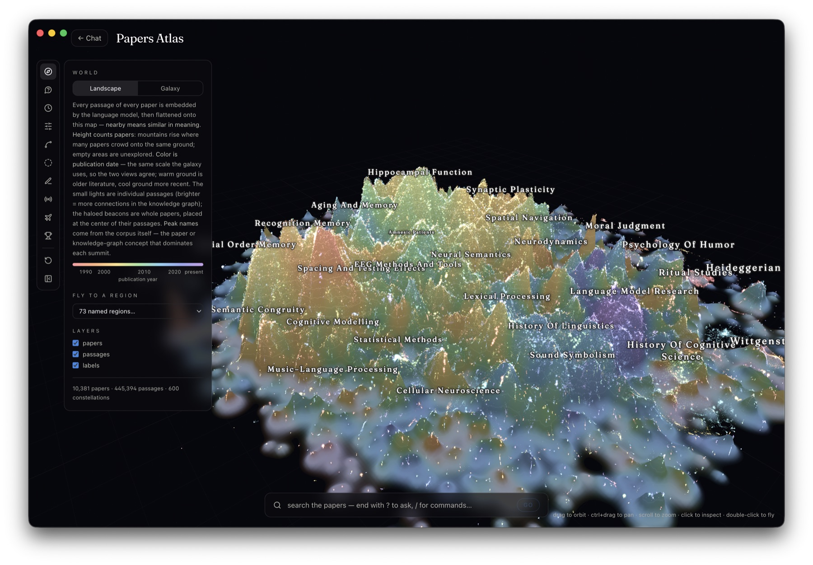
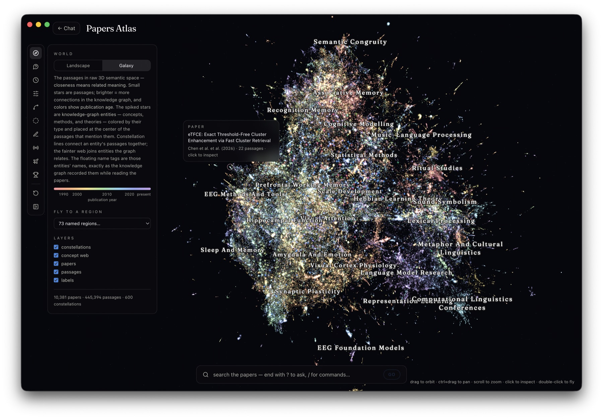
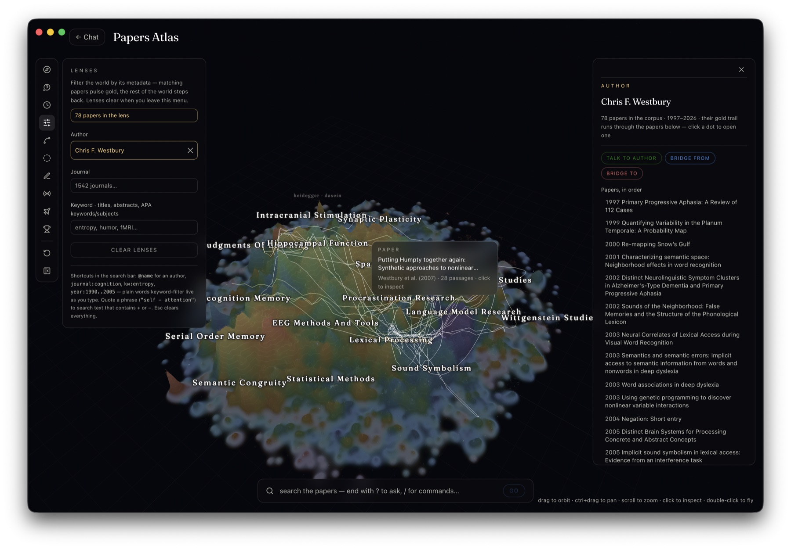

# AP-RAG — Academic Paper Retrieval-Augmented Generation

**The problem.** The biggest roadblock to letting AI agents do real research is hallucination. When a model lacks the full context of a research area, it does not stop — it produces a plausible, confident, wrong answer. The obvious fix is to give it the literature, but that is impossible: a research area is thousands of papers and a context window holds a fraction of one of them.

**The fix.** Retrieval-augmented generation over the papers themselves. AP-RAG turns a library of scientific PDFs into an index an agent can search rather than memorize, and hands back the small number of passages that actually bear on the question — with the paper, the page, and the citation attached, so every claim can be checked against the source it came from.

The live instance indexes **~10,300 papers → 445,394 passages → ~3.6M knowledge-graph entities and ~8.1M relationships**, spanning 1818–2026 across cognitive science, psycholinguistics, neuroscience, and (increasingly) NLP and LLM research.

There are two ways to use it, and they are the two halves of this README:

| | For | Where it runs |
|---|---|---|
| **[The app](#1-the-app)** | People. Chat, digests, trends, a paper browser, a 3D map of the corpus. | Web at [aprag.devon7y.com](https://aprag.devon7y.com), plus native macOS and Windows apps. |
| **[The agentic tools](#2-the-agentic-tools)** | Agents and terminals. An MCP server with nine tools, and a CLI. | Your machine — a thin client, no models, no data. |

Both sit on the same HTTP API and answer from the identical index.


---

## 1. The app

A full research interface over the corpus, shipped as a Next.js web app and wrapped as a native desktop app. Everything below is one product: the sidebar tools, the 3D atlas and the chat share one paper database, one retrieval server, and one citation format.

### Chat, with the citation wired to the page

Ask a question and get a synthesized answer with **APA7 in-text citations** and a reference list. The citations are not decoration: click one and the PDF opens in an in-app reader, scrolled to the page the passage came from, with the retrieved passage highlighted. Verifying a claim is one click, which is the whole point — the answer is an index into the literature, not a replacement for it.


- **Retrieval mode** per message — `auto` (the model picks), `hybrid`, `local`, `global`, `mix`, `naive` (see [Retrieval modes](#retrieval-modes)).
- **Reasoning effort** per message, from none to `xhigh`.
- **Metadata filters** — papers, authors, journals, subjects, keywords, affiliations, year and date ranges. A filtered question genuinely searches only that subset.
- **Chunk mode** shows the raw retrieved passages as cards instead of an answer.
- **Upload papers** that are *not* in the database (a preprint, a manuscript under review) and discuss them alongside the corpus; they are cited in the same numbered reference list and open in the same reader.
- Multi-turn, with follow-up questions condensed into standalone retrieval queries, and shareable chats.

Answers are synthesized by **gpt-5.6-luna**; retrieval comes from the AP-RAG server.

### Research Digest

Give it a topic and a time window and it writes a chronologically sectioned review of what the corpus contains in that window — month by month or year by year, every claim cited. It is a literature review of a slice of the library, and the chat continues normally afterwards.


### Research Trends

What the library has published on, over two centuries. Corpus output per year, and per-term trend lines across **subjects, keywords, regions, journals, authors, affiliations and publication types**, with first/peak/median year and trend slope per term. Because a lab library is not a census of the literature, comparisons default to each term's **share of that year's collected papers**, and where OpenAlex has a matching concept the world-wide curve can be overlaid. Any trend can be handed straight to a Research Digest.


### Talk to Author

Ask a researcher about their own work. Retrieval is locked to the papers that author wrote, the answer is written in the first person, and passages are tagged by authorship position so a paper they led is spoken of differently from one they joined. Every statement still carries a normal citation, and asking about something they never published gets you a plain "I didn't work on that" rather than an invention.


### Papers Database

The whole library as a sortable, filterable table: title, authors, year, journal, keywords, subjects, DOI, abstract, affiliations. Free-text search over the metadata, or press Enter for **semantic search** across the corpus. Every row opens the paper, finds similar papers, or exports.


### Papers Atlas

The corpus as a place. Every passage of every paper is embedded and laid out in 3D, so distance means similarity of meaning, and the same data is shown two ways — a **landscape**, where mountains rise where many papers crowd onto the same ground and empty areas are genuinely unexplored, and a **galaxy**, the raw semantic space with knowledge-graph entities as spiked stars and constellation lines joining an entity's passages. Region names are not hand-written; they come from the corpus itself, the paper or graph concept that dominates each summit.





Colour is publication year on both views, so you can watch where the field moved. **Lenses** filter the world by metadata — matching papers pulse gold, the rest steps back — and an author lens draws their gold trail through the map in publication order, from first paper to last.



The search bar takes plain queries, `@author` / `journal:` / `kw:` / `year:1990..2005` shortcuts, or a question ending in `?` to ask the corpus from inside the world.

### Knowledge Graph

The entity graph built while reading the papers, browsable directly: search entities by name, type or source paper, then open one for its consolidated description, its strongest connections, and the papers it was extracted from. A concept that showed up in an answer becomes a reading list.

### Add papers

Drop PDFs on `/papers/add` (or run `aprag add`) and they are ingested into the live corpus one at a time, without waiting for the next cluster run: dedup → bibliographic record → chunking → contextualization → entity extraction → embeddings → the live vector, graph and metadata stores → atlas placement. Each paper reports the stage it is in, and it is searchable in chat, the database and the atlas within minutes. It uses the **same models as the batch pipeline**, so nothing drifts.

### The desktop apps (macOS & Windows)

The same app as a real dock/taskbar application — `.dmg` for macOS (Apple silicon and Intel), one-click `.exe` for Windows. It is a thin Electron shell around the deployed site, so it stays current with every deploy and holds no data of its own. What it adds over a browser tab: persistent window state and a native title bar, in-app navigation limited to the app (paper links open in your browser), bundled Chromium so the Atlas's WebGPU scene runs on the engine it was built against, offline and crash handling, and **login autofill backed by the OS keystore** (macOS Keychain / Windows DPAPI, behind Touch ID where available) — Chromium cannot reach iCloud Keychain, so the shell provides the equivalent itself.

```bash
cd desktop && npm install
npm start          # dev, against production
npm run dist       # .dmg + .exe into desktop/dist/
```

Releases are built by CI on a `desktop-v*` tag. Build, signing and distribution notes: [desktop/README.md](desktop/README.md).

---

## 2. The agentic tools

The app is one client of the AP-RAG API. The other is a small Python package that puts the same corpus inside an agent or a terminal:

- **`aprag-mcp`** — an MCP server, so Claude Code, Codex, Cursor, Gemini CLI or anything MCP-capable can research the corpus on its own initiative.
- **`aprag`** — a CLI, for one-off questions and scripts.

Neither runs a model or stores a paper. The expensive parts — knowledge graph, vector index, embedding model, answer LLM — stay on the server.

```
your machine
└── aprag package
    ├── aprag       (CLI — you type)          ─┐
    └── aprag-mcp   (MCP server — agent calls)─┤
                                               │  HTTPS + X-API-Key
                                               ▼
                                   AP-RAG query server (FastAPI)
                                    ├── LightRAG knowledge graph (Neo4j)
                                    ├── Qdrant vector DB (4096-dim)
                                    ├── local embedding model
                                    ├── papers_metadata.json (APA7 records)
                                    └── gpt-5.6-luna (answer synthesis only)
```

That split is the reason this is useful to an agent. Retrieval — vector search, graph traversal, metadata filtering, page lookup — is cheap and deterministic, so an agent can call it dozens of times in a session. Synthesis is the only step that runs an LLM on the server, and it is optional: `aprag_retrieve` hands back the raw passages and lets the agent's own model do the reasoning, which is usually what you want when the agent is already good at reading.

### Setup

```bash
pipx install "git+https://github.com/devon7y/AP-RAG.git"   # puts `aprag` + `aprag-mcp` on PATH

aprag config set-server https://rag-api.devon7y.com        # persists to ~/.config/aprag/config
export APRAG_API_KEY=<your-key>                            # the server is public; every request is keyed
aprag health                                               # retrieval_ready / manifest_papers / page_aware
```

Register the MCP server with Claude Code:

```bash
claude mcp add --scope user aprag \
  --env APRAG_QUERY_URL=https://rag-api.devon7y.com \
  --env APRAG_API_KEY=<your-key> \
  -- aprag-mcp
```

Any client that takes the standard `mcp.json` shape (Cursor, Codex, Gemini CLI) uses the same block with `"command": "aprag-mcp"` and those two env vars. **Put the key in the MCP config's `env` block, not only in your shell profile** — an MCP subprocess launched by a GUI client does not read `~/.zshrc`, and that is the most common first failure.

Optionally set `APRAG_PAPERS_DIR` to your paper folders (a Google Drive for Desktop mount counts) and citations resolve to clickable `file://` links on your own disk. That step runs entirely client-side; the server cannot see your filesystem.

### The nine MCP tools

**Retrieval**

| Tool | What it returns |
|---|---|
| `aprag_query` | A finished answer with APA7 in-text citations and a reference list. `reasoning` from `none` to `xhigh`. |
| `aprag_retrieve` | The raw material — the text chunks retrieval surfaced, plus entities and relationships in graph modes. **No LLM runs.** Each chunk carries its paper, reference and PDF page. This is the multi-hop primitive. |
| `aprag_search` | Ranked *papers* rather than an answer: semantic relevance combined with hard metadata filters, each hit an APA7 citation with a link and a snippet. |

**Discovery**

| Tool | What it returns |
|---|---|
| `aprag_corpus` | What the filters actually accept — `authors`, `journals`, `subjects`, `keywords`, `affiliations`, `types`, plus `stats` and `health`. The author facet resolves *people*, not surnames, so two authors sharing a surname are told apart. |
| `aprag_papers` | The corpus as a table, or one paper's full record by filename. Pure metadata, so it still answers when the vector store is down. |

**Exploration**

| Tool | What it returns |
|---|---|
| `aprag_similar` | More like this — the corpus ranked against a paper's mean chunk vector, for growing a reading list from one known-good paper. |
| `aprag_locate` | Which page of a PDF a quoted passage sits on. The citation-verification primitive; `page=null` means unconfirmed. |
| `aprag_graph` | The knowledge graph: find entities by name, type or source paper, or open one entity for its description, strongest connections and source papers. |
| `aprag_trends` | Corpus-wide publication trends — rising, fading, new, bursting — or one term explained with its co-occurrences and who published it when. |

The three retrieval tools and `aprag_papers` accept the metadata filters (`papers`, `authors`, `year`/`year_from`/`year_to`, `date_from`/`date_to`, `journals`, `subjects`, `keywords`, `affiliations`, `types`); `aprag_corpus` is how you find out which values they take. Filters are resolved against the bibliographic manifest into a set of filenames, and retrieval then runs restricted to those files — so a filtered question genuinely searches only that subset rather than searching everything and discarding the rest.

**Four conventions run through all of them**, because the obvious alternatives quietly mislead a model:

- **A filter that matches nothing is an error, not an empty result.** A misspelled author name used to return "0 papers", indistinguishable from a real gap in the corpus — so an agent would confidently report that a lab never studied something. Filter values are validated against the corpus and a mismatch raises with "did you mean" suggestions.
- **Failures raise.** Errors come back as protocol errors, never as prose that reads like an answer, so an outage cannot be mistaken for a finding.
- **Every result is both text and data** — citation-carrying text for the model to read, and `structuredContent` (chunks, entities, references, scores) for code to consume.
- **Everything is read-only**, annotated `readOnlyHint` and `idempotentHint`, so agents can call freely without confirmation prompts.

### The loop this is designed for

`aprag_retrieve` is stateless — each call retrieves independently and the server remembers nothing — so the agent accumulates and deduplicates evidence itself. That makes multi-hop research a loop the agent controls:

```
1.  aprag_corpus(facet="authors", q="Westbury")      → the exact name to filter on
2.  aprag_retrieve("humor and incongruity", mode="local")
                                                     → chunks + entities
3.  aprag_graph(action="entity", name="Semantic Neighbourhood Density")
                                                     → definition, links, source papers
4.  aprag_retrieve("neighbourhood density funniness", mode="naive",
                   authors=["Westbury, Chris"])      → scoped second hop
5.  aprag_similar(filename="Westbury_2016.pdf")      → adjacent work it missed
6.  aprag_locate(filename="Westbury_2016.pdf", quote="…")
                                                     → the page to cite
```

Steps 1 and 6 are the ones that get skipped and then regretted: step 1 stops the agent inventing a filter value, and step 6 is how it proves a quote it is about to attribute really appears in that PDF.

### The CLI

Seven commands. Every one takes `--server`/`--local`, `--json` for machine-readable output, and the same metadata filters as repeatable flags.

| Command | What it does |
|---|---|
| `aprag ask` | A synthesized answer, rendered as markdown in the terminal with APA7 citations and clickable PDF links. Default mode `hybrid`. |
| `aprag chunks` | Raw retrieval, printed as cited markdown — one header per chunk with the paper, page and open-PDF link. Default mode `naive`; `--entities` adds the graph. |
| `aprag search` | Metadata-filtered semantic search over papers. |
| `aprag add` | Uploads PDFs for incremental ingest, streaming each paper's stage. |
| `aprag ingest-status` | Lists ingest jobs, or one job's detail as JSON. |
| `aprag health` | The server's `/health` — the first thing to run when something returns nothing. |
| `aprag config` | Show the resolved server and every source that could set it, or persist a default. |

```bash
# a cited answer, scoped to one researcher and the last decade
aprag ask "what predicts funniness?" --author Westbury --year-from 2015

# evidence instead of an answer, with graph context, from one journal
aprag chunks "semantic neighbourhood density" --mode local --entities \
  --journal Cognition --chunk-top-k 8

# pin retrieval to two specific papers
aprag ask "how were the stimuli chosen?" --paper Westbury_2016 --paper Hollis_2018

# scriptable
aprag chunks "entropy" --json | jq '.data.chunks | length'
aprag ask "word frequency effects" --json | jq -r '.references[].apa'
```

### Retrieval modes

Both clients take a mode, and it changes what retrieval means. Choosing badly is the most common reason a query comes back thin.

| Mode | What it does | Good for |
|---|---|---|
| `naive` | Plain semantic search over passages. No graph. | Passages that literally discuss what you asked. Fastest. |
| `local` | Matches graph entities, then pulls their descriptions and source chunks. | Specific leads: a method, a measure, a named effect. |
| `global` | Retrieves relationships and the entities they connect. | Broad thematic questions no single passage answers. |
| `hybrid` | `local` + `global`. | The right first guess for a real research question. |
| `mix` | Graph retrieval plus straight vector search. | Broadest, slowest, keeps passage-level detail. |

`top_k` caps graph entities and relationships; `chunk_top_k` caps the text chunks kept after reranking. Adding any metadata filter switches retrieval to the chunks-only path — the graph is corpus-wide and cannot be sliced per paper without losing what makes it useful.

### Skipping the client

It is four HTTP endpoints; anything that can POST JSON can use the corpus directly.

```bash
curl -s https://rag-api.devon7y.com/health -H "X-API-Key: $APRAG_API_KEY"

curl -s -X POST https://rag-api.devon7y.com/retrieve \
  -H "Content-Type: application/json" -H "X-API-Key: $APRAG_API_KEY" \
  -d '{"question":"humor","mode":"naive","chunk_top_k":3}'
```

`/query` returns `{answer, references, mode}`; `/retrieve` returns entities, relationships, chunks and references; `/search` returns ranked papers; all three accept the same optional `filters` object. You lose the APA localisation and the "did you mean" filter validation, which is most of what the client is for.

Full reference, including troubleshooting: the **Agentic Tools** page in the app, or [aprag/README.md](aprag/README.md) and [docs/APRAG_ACCESS.md](docs/APRAG_ACCESS.md).

---

## How it works

Three physically separate stages. Knowing which machine runs which is most of understanding the system.

```
┌──────────────────────────────────────────────────────────────────────────────┐
│ 1. INGEST — batch, on HPC GPU clusters (Alliance Canada H100 / A100)          │
│    pipeline/ingest.py, launched by SLURM                                      │
│    PDFs → extract text (page boundaries preserved) → structure-aware chunk    │
│    → contextualize + extract entities/relations (Qwen3.6-35B-A3B on vLLM)     │
│    → embed (Qwen3-Embedding-8B, dim 4096) → graph + KV stores + vectors       │
└──────────────────────────────────────────────────────────────────────────────┘
                              │ storage artifacts
                              ▼
┌──────────────────────────────────────────────────────────────────────────────┐
│ 2. SERVE — always-on PC, public via Cloudflare Tunnel (X-API-Key)             │
│    scripts/server.py  :8000   embeddings (OpenAI-compatible)                  │
│    query_server.py    :8001   LightRAG + Qdrant + Neo4j + the manifest        │
│        POST /query     → synthesized APA-cited answer (gpt-5.6-luna)          │
│        POST /retrieve  → raw entities/relationships/chunks, no LLM            │
│        POST /search    → metadata-filtered ranked papers                      │
└──────────────────────────────────────────────────────────────────────────────┘
                              │
                              ▼
┌──────────────────────────────────────────────────────────────────────────────┐
│ 3. CLIENTS — run no models, hold no data                                      │
│    web app (Vercel) · macOS/Windows app · aprag CLI · aprag-mcp MCP server    │
└──────────────────────────────────────────────────────────────────────────────┘
```

Note the asymmetry: a local open-weights model does the expensive one-time reading (**Qwen3.6-35B-A3B** — a contextualization call and an entity-extraction call for every chunk of every paper, which is why it needs a cluster), and a hosted model does the cheap per-question writing (**gpt-5.6-luna**). Read once, answer forever.

### The academic specialization

AP-RAG is a **wrapper around [LightRAG](https://github.com/HKUDS/LightRAG)**, which provides knowledge-graph construction, multi-mode retrieval and the storage backends. What AP-RAG adds is everything that makes a *paper* different from a blob of text:

- **Structure-aware chunking** ([`pipeline/scientific_chunker.py`](pipeline/scientific_chunker.py)) — splits on a section → paragraph → sentence → token priority rather than a fixed window. It detects scientific sections, distinguishes hard section boundaries from soft subsection headings (Participants, Stimuli, Procedure), strips running heads, mastheads and page numbers, avoids false sentence splits on abbreviations, decimals and initials, isolates figure and table captions, adds overlap only *within* a section, rebalances undersized chunks, and excludes References and Acknowledgements. Every chunk is stamped with the PDF page it starts on — that is where citation page numbers come from.
- **Book chunking** ([`pipeline/book_chunker.py`](pipeline/book_chunker.py)) — chapter detection, skipping contents/index pages, multi-line headings. `CHUNKER_TYPE=auto` routes each document to the right chunker by structure.
- **Contextual retrieval** — before embedding, an LLM writes a short blurb situating each chunk in its paper, which is what keeps a passage findable when it says "this effect" instead of naming it.
- **An academic entity schema** — Author, Concept, Method, Theory, Dataset, Result, Experiment, Finding, Institution, Publication.
- **A bibliographic layer** — `papers_metadata.json`, a per-paper APA7 record (authors, date to day precision where known, journal, DOI, abstract, keywords, subjects, affiliations) built from Crossref plus LLM extraction. It is what the metadata filters resolve against and what turns `[3]` into `(Westbury et al., 2016)`.

### A wrapper, not a fork

Upstream LightRAG lives in a nested, git-ignored `LightRAG/` directory (pinned to **v1.5.3**) and is never edited. Everything AP-RAG adds is injected into the stock `LightRAG` class as functions — a custom `chunking_func`, an embedding function, an LLM function — never as an in-library patch.

```
import lightrag (unmodified, upstream)  ──►  LightRAG(chunking_func=…, embedding_func=…, llm_model_func=…)
                                                        ▲
        AP-RAG wrappers (this repo, in pipeline/) ──────┘
```

The point is upgradability: when a newer LightRAG ships, you drop it in and the wrapper keeps working, so AP-RAG always rides the latest engine and can be swapped for a different one entirely. That only holds while the fork stays patch-free, so a clean `git status` inside `LightRAG/` is the target state.

---

## Repository layout

| Path | What it is |
|---|---|
| [`web/`](web/) | The Next.js 16 web app deployed at aprag.devon7y.com — chat, digest, trends, authors, graph, papers browser, atlas, agentic-tools page. See [web/README.md](web/README.md) and [web/ATLAS.md](web/ATLAS.md). |
| [`desktop/`](desktop/) | The Electron shell packaged as macOS `.dmg` + Windows `.exe`. See [desktop/README.md](desktop/README.md). |
| [`aprag/`](aprag/) | The installable client package: the `aprag` CLI and the `aprag-mcp` MCP server. |
| `query_server.py`, `aprag_*.py`, `apa_citations.py` | The serving stack on the always-on PC: retrieval API, search, graph, trends, PDF locate, incremental ingest, APA citation rewriting. |
| [`pipeline/`](pipeline/) | The ingest package: structure-aware chunkers, contextual-retrieval wrapper, and `ingest.py`. |
| [`scripts/`](scripts/) | Maintenance and utility scripts: the embedding server, prechunkers, graph/embedding rebuilders, Qdrant migration, manifest builders, PDF/OCR tools. |
| [`slurm/`](slurm/) | Per-cluster SLURM jobs for the corpus runs. |
| [`tests/`](tests/) | Fast, local chunker tests. |
| [`docs/`](docs/) | Runbooks and operational notes (point-in-time; verify against the code). |
| `LightRAG/` | **Upstream LightRAG, git-ignored** — its own repo, pinned to v1.5.3, never edited. |
| [`CLAUDE.md`](CLAUDE.md) | The in-depth internal guide to this codebase. |

---

## Running it yourself

### Clients

```bash
git clone https://github.com/devon7y/AP-RAG.git && cd AP-RAG
pip install -e .          # exposes `aprag` and `aprag-mcp`
```

### The chunkers (the only fast, machine-independent tests here)

```bash
pip install -e .
python -m pytest tests/ -v
python -m pytest tests/test_chunkers_pdf.py -v     # runs the chunkers over real sample PDFs
ruff check .
```

### The serving stack

```bash
python -m uvicorn server:app       --host 0.0.0.0 --port 8000   # embeddings (scripts/server.py)
python -m uvicorn query_server:app --host 0.0.0.0 --port 8001   # query API (LightRAG + Qdrant + Neo4j)
```

`restart_aprag_pc.sh` restarts the whole PC stack. The paper database is `data/papers_metadata.json` + `data/drive_links.json`; after either changes, `scripts/propagate_papers.sh` re-derives every downstream pack and redeploys ([docs/SINGLE_DATABASE.md](docs/SINGLE_DATABASE.md)).

### Ingestion (needs GPUs)

Batch ingest is submitted via SLURM on Alliance Canada clusters. The standard pattern is **N vLLM jobs serving Qwen3.6-35B-A3B + one ingest job** with a dependency; per-cluster scripts are suffixed `_fir` / `_ror` / `_nibi` / `_tril` / `_nar`. Exact commands and proven parameters: [docs/CANONICAL_INGEST_PARAMS.md](docs/CANONICAL_INGEST_PARAMS.md).

| Mode | What it does | When |
|---|---|---|
| `resume` (default) | Continue; skip processed docs; reuse all caches. | Normal incremental runs. |
| `fresh` | Wipe doc-status/graph/vectors but **keep** the LLM response cache. | Re-run without paying for extraction again. |
| `reembed` (`REBUILD_EMBEDDINGS=1`) | Rebuild only the vector DB from cached chunks + graph; no vLLM needed. | Switching embedding model or vector backend. |

An optional native-multimodal path (`INGEST_VLM=1`) parses figures, tables and equations with MinerU and captions them into the chunks and the graph ([docs/VLM_INGEST.md](docs/VLM_INGEST.md)).

### Configuration

Behavior is driven by environment variables, not code edits.

| Variable | Purpose |
|---|---|
| `CHUNKER_TYPE` | `scientific` (default), `book`, or `auto` (per-document structure routing). |
| `CHUNK_TARGET_TOKENS` / `CHUNK_MAX_TOKENS` / `CHUNK_MIN_TOKENS` / `CHUNK_OVERLAP_TOKENS` | Chunk sizing (defaults 512 / 640 / 192 / 51, set by the chunk-size eval in `scripts/chunk_eval/`). |
| `CHUNK_EXCLUDE_REFS` / `CHUNK_EXCLUDE_ACK` | Drop References / Acknowledgements. |
| `CONTEXTUALIZE_CHUNKS` | `1` (default) enables contextual retrieval. |
| `LLM_MODEL` / `EMBED_MODEL_ID` | Ingest LLM and embedding model. |
| `PARALLEL_DOCS`, `LLM_MAX_ASYNC`, `CONTEXT_MAX_ASYNC`, `EMBED_FUNC_MAX_ASYNC`, `MAX_PARALLEL_INSERT` | Ingest concurrency ([docs/CANONICAL_INGEST_PARAMS.md](docs/CANONICAL_INGEST_PARAMS.md)). |
| `QDRANT_URL` | Use Qdrant for vectors; otherwise file-based NanoVectorDB. |
| `APRAG_QUERY_URL` / `APRAG_API_KEY` | Where clients send requests, and the shared secret. |
| `APRAG_PAPERS_DIR` | Client-side paper folders, for `file://` citation links. |

> Changing the embedding model or its dimension requires rebuilding the vector store (`reembed` mode) — embeddings must be identical at index and query time.

---

## Status & access

Active work in progress. The serving stack, the web and desktop apps, and the agentic clients are in daily use; several `docs/*.md` files are operational session notes rather than stable documentation, and the live instance is login-gated to an allowlist. For access to the hosted corpus, or an API key, ask Devon.

## Acknowledgements

AP-RAG is built on **[LightRAG](https://github.com/HKUDS/LightRAG)** by HKUDS, which provides the knowledge-graph construction, multi-mode retrieval and storage backends. AP-RAG adds the academic-paper specialization on top and leaves LightRAG unmodified so it can be upgraded independently. All credit for the underlying RAG engine goes to the LightRAG authors. The web app began as the Vercel `chatbot` template.
